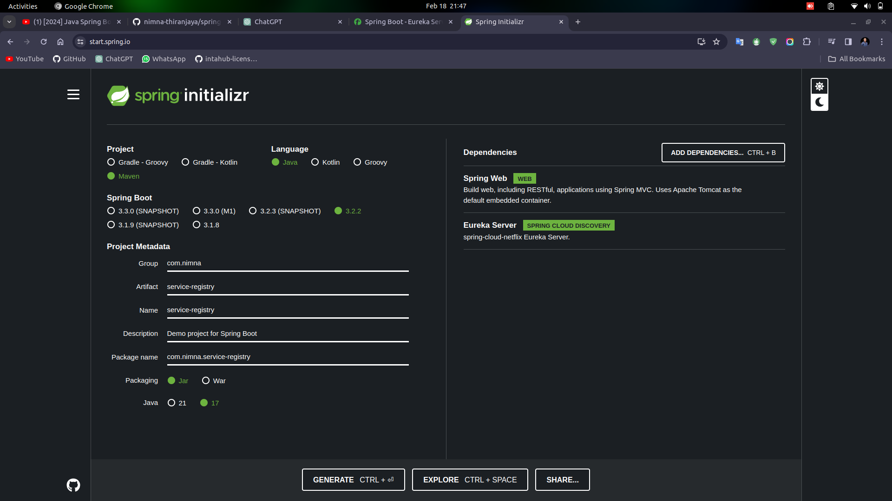

# Service Registry

service registry acts as this directory. It keeps track of all the available services and their network locations. When one microservice needs to communicate with another, it consults the service registry to find out where the desired service is located. This makes communication between microservices much more efficient,

## Eureka Server (Spring Cloud Netflix) <a href="https://cloud.spring.io/spring-cloud-netflix/reference/html/#service-discovery-eureka-clients" target="_blank">Documentation </a>

Eureka Server is an application that holds the information about all client-service applications. Every Micro service will register into the Eureka server and Eureka server knows all the client applications running on each port and IP address. Eureka Server is also known as Discovery Server.

### service registry implementation in /project/serviceRegistry project

#### special notes

Service registry init

